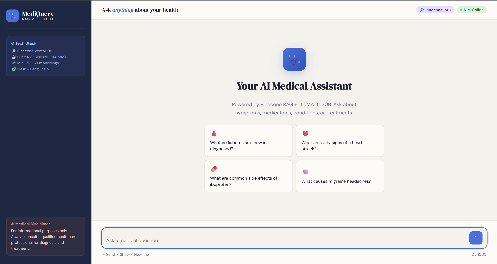
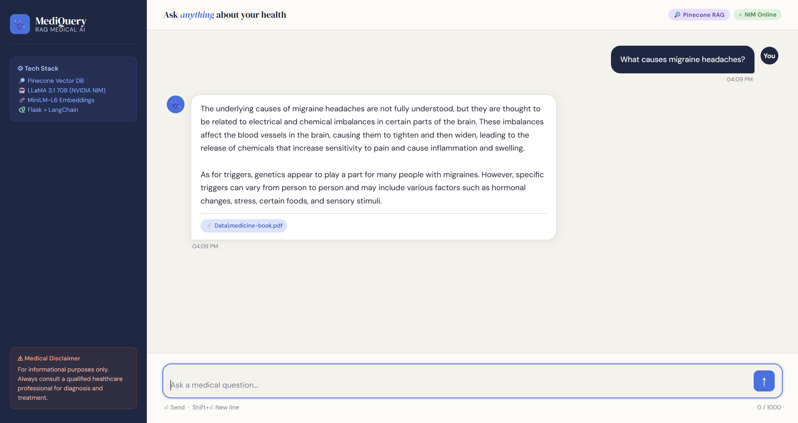

# 🩺 MediQuery — RAG-Based Medical Chatbot

A production-ready Retrieval-Augmented Generation (RAG) medical chatbot powered by **Pinecone**, **LLaMA 3.1 70B** (via NVIDIA NIM), and **LangChain**, served through a **Flask** backend with a clean, responsive web UI.

---

## 📸 Screenshots

| Welcome Screen | Chat in Action |
|---|---|
|  |  |

---

## ✨ Features

- 🔍 **RAG Pipeline** — Retrieves relevant chunks from a Pinecone vector database before answering, grounding every response in your medical documents
- 🧠 **Question Rewriting** — Rewrites follow-up questions to be self-contained using chat history, so context is never lost
- 💬 **Conversation Memory** — Maintains per-session chat history (last 5 turns) without a database
- 📄 **Source Citations** — Every answer shows which PDF file the information was retrieved from
- ⚡ **LLaMA 3.1 70B** — State-of-the-art open-source LLM served via NVIDIA NIM API
- 🌐 **Flask Web App** — Serves the frontend as a Jinja2 template; no separate frontend server needed
- 📱 **Responsive UI** — Works on desktop and mobile

---

## 🗂️ Project Structure

```
RAG-BASED-MEDICAL-CHATBOT/
│
├── Data/                        # Your medical PDF files go here
│   └── medicine-book.pdf
│
├── Experiment/
│   └── full_code.ipynb          # Prototyping notebook
│
├── src/                         # Core application modules
│   ├── __init__.py
│   ├── config.py                # API keys, model name, constants
│   ├── loader.py                # PDF loading, chunking, embeddings
│   ├── retriever.py             # Pinecone vector store + retriever
│   ├── llm.py                   # NVIDIA NIM LLM setup
│   ├── prompt.py                # System prompt + rewrite prompt
│   ├── question_chain.py        # Question rewriting chain
│   ├── rag_chain.py             # Full RAG chain (retriever + LLM)
│   └── memory.py                # Per-session chat history
│
├── static/
│   └── style.css                # Frontend styles
│
├── templates/
│   └── index.html               # Chat UI (Jinja2 template)
│
├── app.py                       # Flask app — routes: /, /chat, /clear
├── store_vectors.py             # One-time script: embed PDFs → Pinecone
├── setup.py                     # Package setup
├── requirements.txt
└── .env                         # API keys (never commit this)
```

---

## ⚙️ How It Works

```
User Question
     │
     ▼
Question Rewriting Chain          ← rewrites question using chat history
     │                               so follow-ups are self-contained
     ▼
Pinecone Retriever                ← finds top-3 similar chunks (cosine similarity)
     │                               using all-MiniLM-L6-v2 embeddings (dim=384)
     ▼
Stuff Documents Chain             ← injects retrieved chunks into the prompt
     │
     ▼
LLaMA 3.1 70B (NVIDIA NIM)       ← generates the final answer
     │
     ▼
Flask → JSON response             ← { answer, sources }
     │
     ▼
Browser UI                        ← renders answer + source chips
```

---

## 🚀 Getting Started

### 1. Clone the repository

```bash
git clone https://github.com/your-username/rag-medical-chatbot.git
cd rag-medical-chatbot
```

### 2. Create and activate a virtual environment

```bash
python -m venv .venv

# Windows
.venv\Scripts\activate

# macOS / Linux
source .venv/bin/activate
```

### 3. Install dependencies

```bash
pip install -r requirements.txt
```

### 4. Set up environment variables

Create a `.env` file in the project root:

```env
PINECONE_API_KEY=your-pinecone-api-key-here
NVIDIA_NIM=your-nvidia-nim-api-key-here
```

| Variable | Where to get it |
|---|---|
| `PINECONE_API_KEY` | [app.pinecone.io](https://app.pinecone.io) → API Keys |
| `NVIDIA_NIM` | [build.nvidia.com](https://build.nvidia.com) → Get API Key |

### 5. Add your medical PDFs

Place your PDF files inside the `Data/` folder:

```
Data/
├── medicine-book.pdf
├── drug-reference.pdf
└── who-guidelines.pdf
```

### 6. Embed documents into Pinecone (run once)

This script reads all PDFs in `Data/`, chunks them, embeds them, and uploads to Pinecone:

```bash
python store_vectors.py
```

> ⚠️ Only run this once (or whenever you add new documents). It creates a Pinecone index named `medical-chatbot` with dimension `384` and cosine metric on AWS `us-east-1`.

### 7. Start the Flask server

```bash
python app.py
```

Open your browser at **http://localhost:5000**

---

## 🔌 API Reference

### `POST /chat`

Send a user message and get an AI answer.

**Request body:**
```json
{
  "message": "What is diabetes?",
  "session_id": "user-abc123"
}
```

**Response:**
```json
{
  "answer": "Diabetes is a chronic condition...",
  "sources": ["Data\\medicine-book.pdf"]
}
```

---

### `POST /clear`

Clear the conversation history for a session.

**Request body:**
```json
{
  "session_id": "user-abc123"
}
```

**Response:**
```json
{
  "status": "History cleared"
}
```

---

### `GET /`

Serves the chat UI (`templates/index.html`).

---

## 🧩 Module Reference

| File | Purpose |
|---|---|
| `src/config.py` | Loads `.env`, exports `PINECONE_API_KEY`, `NVIDIA_NIM`, `MODEL_NAME`, `MAX_HISTORY`, `index_name` |
| `src/loader.py` | `load_files()` — loads PDFs via `DirectoryLoader`; `spilt_text()` — chunks with `RecursiveCharacterTextSplitter` (500 chars, 50 overlap); `download_embeddings()` — loads `all-MiniLM-L6-v2` |
| `src/retriever.py` | Connects to the existing Pinecone index, returns a similarity retriever (`k=3`) |
| `src/llm.py` | Instantiates `ChatOpenAI` pointed at NVIDIA NIM base URL with LLaMA 3.1 70B |
| `src/prompt.py` | Defines `prompt` (RAG answer) and `rewrite_prompt` (question rewriting) |
| `src/question_chain.py` | `rewrite_prompt \| llm` — rewrites ambiguous questions using chat history |
| `src/rag_chain.py` | Combines retriever + LLM into a full `RetrievalQA` chain |
| `src/memory.py` | In-memory `chat_sessions` dict; `get_history`, `update_history`, `format_history` helpers |
| `store_vectors.py` | One-time indexing script — creates Pinecone index and upserts embedded chunks |
| `app.py` | Flask routes: `/` (UI), `/chat` (RAG answer), `/clear` (reset session) |

---

## 🛠️ Tech Stack

| Layer | Technology |
|---|---|
| **LLM** | LLaMA 3.1 70B Instruct (NVIDIA NIM) |
| **Embeddings** | `sentence-transformers/all-MiniLM-L6-v2` (384-dim) |
| **Vector DB** | Pinecone (Serverless, AWS us-east-1, cosine metric) |
| **RAG Framework** | LangChain 0.2 |
| **Backend** | Flask 3.0 |
| **Frontend** | Vanilla HTML + CSS (DM Sans + DM Serif Display) |
| **PDF Parsing** | PyPDF via LangChain `PyPDFLoader` |

---

## 🔧 Configuration

All tuneable constants live in `src/config.py`:

```python
MODEL_NAME  = "meta/llama-3.1-70b-instruct"   # LLM model
MAX_HISTORY = 5                                 # Turns of memory per session
index_name  = "medical-chatbot"                # Pinecone index name
```

Chunking settings are in `src/loader.py`:

```python
chunk_size    = 500   # Characters per chunk
chunk_overlap = 50    # Overlap between chunks
```

Retriever settings are in `src/retriever.py`:

```python
search_type   = "similarity"
k             = 3     # Number of chunks retrieved per query
```

---

## ➕ Adding New Documents to the Database

To add new PDFs to the existing Pinecone index **without re-creating it**:

1. Copy your new PDFs into `Data/`
2. Modify `store_vectors.py` — replace `pc.create_index(...)` with a connection to the existing index:

```python
# Instead of pc.create_index(...), use:
index = pc.Index(index_name)

# Then upsert new documents:
PineconeVectorStore.from_documents(chunks, embeddings, index_name=index_name)
```

Or simply add a new script `add_data.py`:

```python
from src.loader import load_files, spilt_text, download_embeddings
from langchain_pinecone import PineconeVectorStore
from src.config import index_name
import os

# Load only new files
new_docs  = load_files("Data/new/")          # Put new PDFs in Data/new/
chunks    = spilt_text(new_docs)
embeddings = download_embeddings()

PineconeVectorStore.from_documents(chunks, embeddings, index_name=index_name)
print(f"Added {len(chunks)} chunks to Pinecone index '{index_name}'")
```

---

## ⚠️ Important Notes

- **This is not a substitute for professional medical advice.** The chatbot is for informational purposes only.
- The LLM is instructed to answer **only from retrieved documents**. If the answer is not in your PDFs, it will say so.
- Chat history is stored **in memory** — it resets when Flask restarts. For persistence, replace `chat_sessions` dict in `memory.py` with Redis or a database.
- Never commit your `.env` file. Add it to `.gitignore`.

---

## 📄 License

MIT License — see `LICENSE` for details.

---

## 👤 Author

**TRISH** · trishpurkat@gmail.com